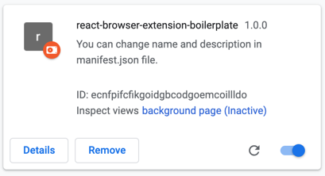
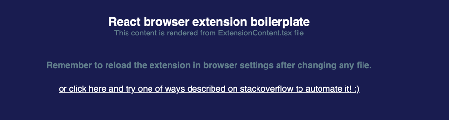
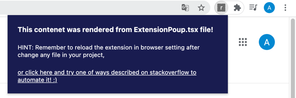

# React browser extension boilerplate
Create your own browser extension using React!


## How to setup
Clone repository
```bash
git clone https://github.com/a-bugaj/react-browser-extension-boilerplate.git
```

Install dependencies
```shell
yarn install or npm install
```

Run in dev mode
```shell
yarn start:dev or npm run start:dev
```

At this point, webpack should generate a dist folder and update it with every change.

- Open your  browser (for example chrome), and go to `chrome://extensions/` and turn on developer mode <br/>


- Click `Load unpack` button and select dist folder
- After that, you should see something like this:<br />

- After visiting any page, you should see content rendered from ExtensionContent.tsx file <br />
<b>IMPORTANT:</b> Webpack detect any changes and generate new dist folder but on your side is (unfortunately) reloading of the web extension in the browser.

- Clicking on the extension icon on browser extension bar should render the content from the ExtensionPopup.tsx file <br />
 

## Features:
- Separate entry for Background, Popup and Content ✨
- Hot reloading browser extension 💨
- Support css-in-js (Emotion) ✔️
- Absolute paths - everything happens automatically so you don't have to remember to add new folders to your configuration! ✔️
- Typescript with strong typing settings ✔️
- Linting and formating code via eslint and typescript ✔️